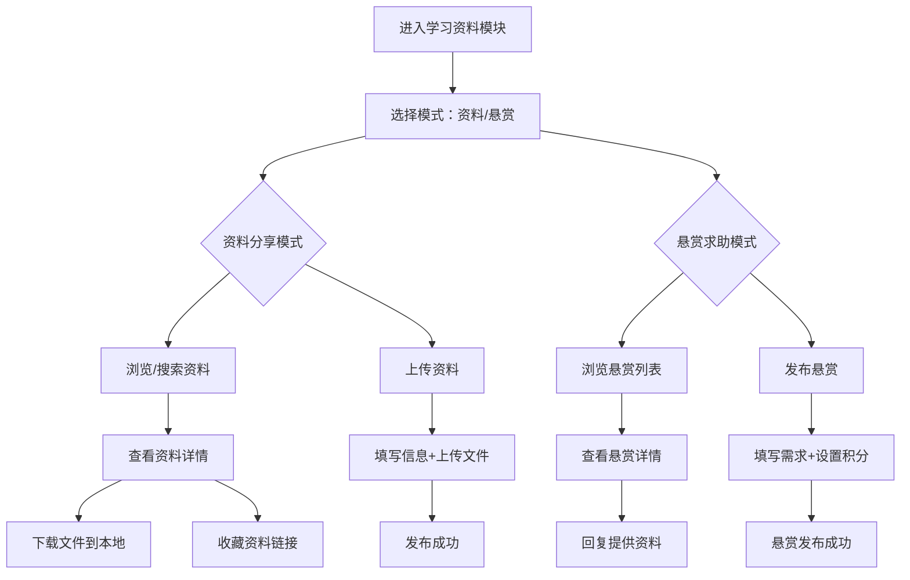

## 1. 产品概述

学习资料/考研考证互助模块，与二手市场图书分类形成互补。为校园学生提供学习资料分享与互助平台，解决学习资源获取难、备考信息不对称等问题。

- 核心价值：打造校园学习资源共享生态，促进知识传播与互助
- 目标用户：在校本科生、研究生、备考学生
- 互补关系：二手市场侧重实体图书交易，本模块侧重电子资料分享与互助

## 2. 核心功能

### 2.1 用户角色
| 角色 | 注册方式 | 核心权限 |
|------|----------|----------|
| 普通用户 | 校园账号登录 | 浏览、搜索、上传资料、下载、收藏、发布悬赏求助 |

### 2.2 功能模块
1. **资料列表页**：分类导航、搜索栏、资料卡片列表、切换资料/悬赏模式
2. **资料详情页**：资料预览、下载按钮、收藏按钮、版权提示、分享功能
3. **资料上传页**：文件/图片上传、分类选择、课程信息填写、描述编辑
4. **悬赏求助页**：悬赏发布、积分设置、需求描述、资料分类
5. **悬赏详情页**：悬赏内容、已回复列表、最佳答案标记、积分结算

### 2.3 页面详情
| 页面名称 | 模块名称 | 功能描述 |
|----------|----------|----------|
| 资料列表页 | 分类导航 | 课程、考研、考公、四六级、竞赛五大分类切换 |
| 资料列表页 | 搜索功能 | 按课程名、老师、学期搜索资料 |
| 资料列表页 | 资料卡片 | 显示标题、分类、上传者、下载量、收藏数 |
| 资料列表页 | 模式切换 | 切换"资料分享"和"悬赏求助"两种模式 |
| 资料详情页 | 资料预览 | 图片/文件预览、内容展示 |
| 资料详情页 | 下载功能 | 本地保存文件到相册或文件系统 |
| 资料详情页 | 收藏功能 | 收藏链接，方便后续查看 |
| 资料详情页 | 版权提示 | 底部显示"仅供学习交流，请勿商用"提示 |
| 资料上传页 | 文件上传 | 支持上传笔记、试卷、课件（文件或图片） |
| 资料上传页 | 信息填写 | 标题、分类、课程名、老师、学期、描述 |
| 悬赏求助页 | 悬赏发布 | 填写需求、设置悬赏积分、选择分类 |
| 悬赏详情页 | 回复功能 | 用户可回复提供资料链接或信息 |

## 3. 核心流程

### 3.1 资料分享流程
用户进入资料列表 → 点击上传按钮 → 选择分类 → 填写资料信息 → 上传文件/图片 → 提交发布 → 资料展示在列表中

### 3.2 资料获取流程
用户浏览列表/搜索 → 点击资料卡片 → 查看详情 → 下载文件到本地 或 收藏链接

### 3.3 悬赏求助流程
用户进入悬赏列表 → 点击发布悬赏 → 填写需求描述 → 设置悬赏积分 → 选择分类 → 提交 → 其他用户查看并回复 → 提问者采纳最佳答案 → 积分结算

## 4. 用户界面设计

### 4.1 设计风格
- 主色调：延续校园主题色 #FF6B6B（活力红）
- 辅助色：#4ECDC4（学习蓝）用于标识学习相关功能
- 按钮风格：圆角胶囊按钮，带有微妙阴影
- 字体：系统默认字体，标题加粗，正文适中
- 布局风格：卡片式布局，分类标签导航，网格流布局
- 图标风格：线性图标，配色与分类对应

### 4.2 页面设计概述
| 页面名称 | 模块名称 | UI Elements |
|----------|----------|-------------|
| 资料列表页 | 顶部导航 | 搜索框、模式切换标签（资料/悬赏） |
| 资料列表页 | 分类导航 | 横向滚动分类标签：课程、考研、考公、四六级、竞赛 |
| 资料列表页 | 资料卡片 | 缩略图、标题、分类标签、上传者、下载量、收藏数 |
| 资料列表页 | 悬浮按钮 | 右下角"+"发布按钮 |
| 资料详情页 | 头部区域 | 资料标题、分类标签、上传者信息 |
| 资料详情页 | 预览区域 | 图片轮播或文件图标展示 |
| 资料详情页 | 信息区域 | 课程名、老师、学期、描述 |
| 资料详情页 | 操作区域 | 下载按钮、收藏按钮、分享按钮 |
| 资料详情页 | 底部提示 | 版权声明条，固定在底部 |
| 资料上传页 | 表单区域 | 标题输入、分类选择、课程信息、描述 |
| 资料上传页 | 上传区域 | 拖拽上传区、图片/文件预览网格 |
| 悬赏求助页 | 表单区域 | 标题输入、分类选择、需求描述、积分设置 |

### 4.3 响应性
- 移动端优先设计，适配微信小程序环境
- 触摸交互优化：点击区域 ≥ 44x44px
- 列表页面支持下拉刷新和上拉加载
- 输入框自动适配键盘弹出

### 4.4 分类配色方案
- 课程：#4ECDC4（青绿色）
- 考研：#FF6B6B（珊瑚红）
- 考公：#45B7D1（天蓝色）
- 四六级：#96CEB4（薄荷绿）
- 竞赛：#FFEAA7（暖黄色）
