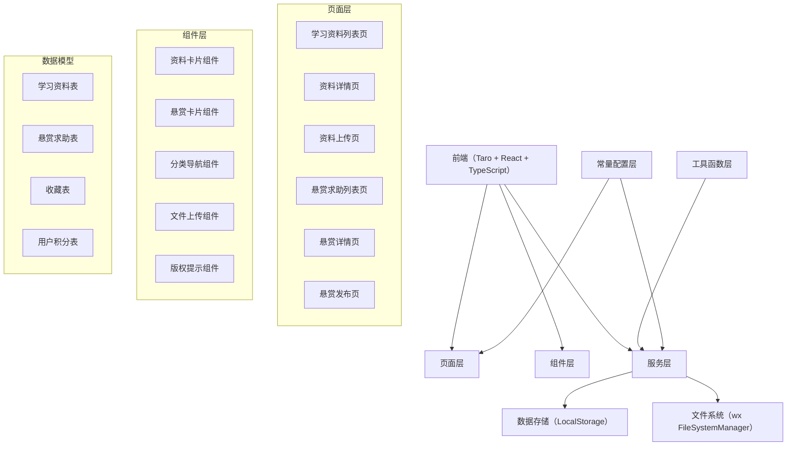
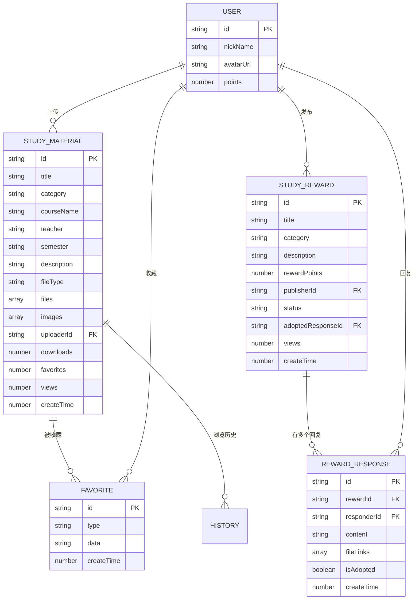

## 1. 架构设计



## 2. 技术描述
- 前端框架：Taro 4.1.9 + React 18 + TypeScript
- 样式方案：Sass (SCSS)
- 状态管理：zustand 4.5.0
- 数据存储：微信小程序 LocalStorage + 文件系统
- 初始化工具：Taro CLI 4.1.9
- 后端：无后端，纯前端模拟实现（使用 mock 数据 + 本地存储）
- 数据库：LocalStorage（键值对存储）

## 3. 页面路由定义
| 路由 | 用途 |
|------|------|
| /pages/study-materials/index | 学习资料列表页（资料+悬赏切换） |
| /pages/study-materials/detail | 资料详情页 |
| /pages/study-materials/upload | 资料上传页 |
| /pages/study-reward/index | 悬赏求助列表页（可与资料列表合并） |
| /pages/study-reward/detail | 悬赏详情页 |
| /pages/study-reward/publish | 悬赏发布页 |

## 4. API 数据类型定义

### 4.1 学习资料类型定义
```typescript
interface StudyMaterial {
  id: string;
  title: string;
  category: 'course' | 'postgraduate' | 'civil' | 'cet' | 'competition';
  courseName?: string;
  teacher?: string;
  semester?: string;
  description: string;
  fileType: 'image' | 'pdf' | 'doc' | 'other';
  files: string[];
  images: string[];
  uploaderId: string;
  uploaderName: string;
  uploaderAvatar?: string;
  downloads: number;
  favorites: number;
  views: number;
  createTime: number;
  updateTime: number;
}

interface StudyReward {
  id: string;
  title: string;
  category: 'course' | 'postgraduate' | 'civil' | 'cet' | 'competition';
  description: string;
  rewardPoints: number;
  courseName?: string;
  teacher?: string;
  semester?: string;
  publisherId: string;
  publisherName: string;
  publisherAvatar?: string;
  status: 'open' | 'closed' | 'adopted';
  responses: RewardResponse[];
  adoptedResponseId?: string;
  views: number;
  createTime: number;
  updateTime: number;
}

interface RewardResponse {
  id: string;
  rewardId: string;
  responderId: string;
  responderName: string;
  responderAvatar?: string;
  content: string;
  fileLinks?: string[];
  isAdopted: boolean;
  createTime: number;
}
```

### 4.2 存储键定义
```typescript
const STORAGE_KEYS = {
  STUDY_MATERIALS_LIST: 'studyMaterialsList',
  STUDY_REWARDS_LIST: 'studyRewardsList',
  USER_POINTS: 'userPoints',
  // 复用已有：FAVORITES, HISTORY, SEARCH_HISTORY
};
```

## 5. 数据模型

### 5.1 ER 图


### 5.2 初始化数据
```javascript
// 学习资料 mock 数据
const MOCK_STUDY_MATERIALS = [
  {
    title: '高等数学期末复习笔记',
    category: 'course',
    courseName: '高等数学',
    teacher: '张教授',
    semester: '2025-2026-1',
    description: '整理了整学期的重点笔记，包含例题解析和公式总结',
    fileType: 'image',
    images: ['https://picsum.photos/seed/math1/800/1000']
  },
  {
    title: '考研英语历年真题解析',
    category: 'postgraduate',
    description: '2018-2025年考研英语一真题及详细解析',
    fileType: 'pdf',
    images: ['https://picsum.photos/seed/english1/800/600']
  },
  {
    title: '考公行测解题技巧',
    category: 'civil',
    description: '行测五大模块解题技巧汇总，附例题',
    fileType: 'doc',
    images: ['https://picsum.photos/seed/gov1/800/600']
  }
];

// 悬赏求助 mock 数据
const MOCK_STUDY_REWARDS = [
  {
    title: '求数据结构期末试卷',
    category: 'course',
    courseName: '数据结构',
    teacher: '李教授',
    semester: '2024-2025-2',
    description: '求去年数据结构期末试卷，最好有答案',
    rewardPoints: 50
  },
  {
    title: '求考研政治肖四肖八',
    category: 'postgraduate',
    description: '求2026考研政治肖四肖八电子版，感激不尽！',
    rewardPoints: 100
  }
];
```

## 6. 分类常量定义
```javascript
const STUDY_MATERIAL_CATEGORIES = [
  { value: 'course', label: '课程', color: '#4ECDC4', icon: '📚' },
  { value: 'postgraduate', label: '考研', color: '#FF6B6B', icon: '🎓' },
  { value: 'civil', label: '考公', color: '#45B7D1', icon: '🏛️' },
  { value: 'cet', label: '四六级', color: '#96CEB4', icon: '📝' },
  { value: 'competition', label: '竞赛', color: '#FFEAA7', icon: '🏆' }
];

const SEMESTER_OPTIONS = [
  { value: '2025-2026-2', label: '2025-2026学年第二学期' },
  { value: '2025-2026-1', label: '2025-2026学年第一学期' },
  { value: '2024-2025-2', label: '2024-2025学年第二学期' },
  { value: '2024-2025-1', label: '2024-2025学年第一学期' }
];

const REWARD_POINTS_OPTIONS = [10, 20, 50, 100, 200, 500];
```
